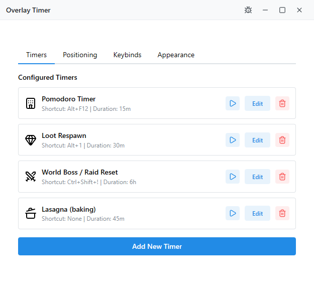
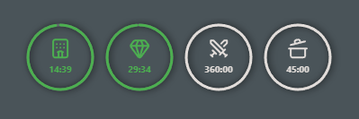

    # Overlay Timer

    A lightweight, customizable overlay timer application built with Tauri v2, React, and TypeScript. Perfect for gaming, productivity, and any scenario where you need visual timers that don't interfere with your workflow.

    ## Features

    - 🎯 **Multiple Timers & Stopwatches**: Independent countdowns and stopwatches, each with its own global shortcut
    - 👋 **Built-in Onboarding**: Welcome modal explains the basics the first time you open Settings
    - ⌨️ **Global Shortcuts**: Works even in fullscreen games thanks to low-level hooks
    - 🔁 **Repeats + Intervals**: Countdown timers can auto-repeat with custom interval notifications
    - 🍅 **Pomodoro Presets**: Two ready-to-use presets (25/5 min) plus your own custom preset library
    - 🔔 **Notifications**: Windows toasts + sounds with configurable text per timer/interval
    - 🎨 **Customizable Appearance**: Icons, colors, stroke, monitor position, compact mode
    - 🕹️ **Game-Friendly Reset**: Default `Ctrl+Alt+P` resets all timers (change it in Keybinds tab)

    ## Screenshots

    

    

    ## Installation

    ### Windows

    Download the latest release from the [Releases](https://github.com/LucasHenriqueDiniz/simple-overlay-timer/releases) page and run the installer.

    ## Usage

    1. **Open Settings**: Right-click the tray icon → “Settings”. A welcome modal will guide first-time users.
    2. **Add Timers**: “Add Timer” lets you pick countdown or stopwatch, icons, repeats, intervals, etc.
    3. **Set Shortcuts**: Each shortcut must include a modifier (Alt/Ctrl/Shift/Meta). Use the Keybinds tab for global actions like “Reset All”.
    4. **Use Presets**: The Keybinds tab ships with Pomodoro focus/break presets (Ctrl+Alt+1 / Ctrl+Alt+2). Edit or add your own.
    5. **Start/Reset**: Press your timer shortcut to start it. Tap again to restart; hold the stopwatch shortcut to reset.
    6. **Reset Everything**: Use the tray menu or the global reset shortcut (default `Ctrl+Alt+P`) to stop every timer at once.

    ## Development

    ### Prerequisites

    - Node.js 18+ and npm
    - Rust (latest stable)
    - Windows SDK (for Windows builds)

    ### Setup

    ```bash
    # Install dependencies
    npm install

    # Run in development mode
    npm run tauri dev

    # Build for production
    npm run tauri build
    ```

    ## Building

    The application uses Tauri v2 for cross-platform desktop builds. Builds are automatically created via GitHub Actions on every release tag.

    ## License

    MIT License - see LICENSE file for details

    ## Roadmap

    See [TODO.md](TODO.md) for planned features and improvements.

    ## Contributing

    Contributions are welcome! Please feel free to submit a Pull Request.
